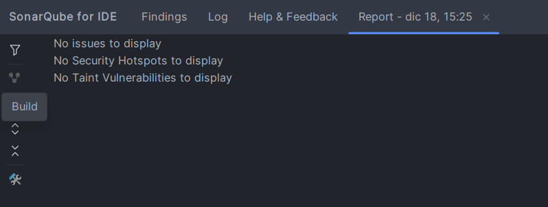

# 📚 Microservicio de Préstamos

## 📋 Descripción
Este microservicio gestiona todo el ciclo de vida de los préstamos de libros en la biblioteca. Se encarga de coordinar entre usuarios y libros, validando que el usuario esté activo y que haya stock disponible antes de registrar un préstamo, además de manejar las devoluciones actualizando el inventario automáticamente.

## 🏗️ Arquitectura
- **Spring Boot 3.x** con arquitectura en capas
- **PostgreSQL** como base de datos
- **Spring Cloud Netflix Eureka** para service discovery
- **Spring Cloud OpenFeign** para comunicación entre microservicios
- **Spring Data JPA** para persistencia
- **Swagger/OpenAPI** para documentación
- **JUnit 5 + Mockito + MockServer** para testing

## 🚀 Cómo ejecutar

### 📦 Prerrequisitos obligatorios:
1. ✅ **Java 17+** instalado
2. 🐘 **PostgreSQL 14+** corriendo
3. 🔗 **Eureka Server** corriendo en `http://localhost:8761`
4. 📱 **Microservicio Usuarios** corriendo en puerto 8083
5. 📚 **Microservicio Libros** corriendo en puerto 8081
6. 📦 **Maven 3.8+** instalado

### 📝 Pasos:
1. Crear base de datos en PostgreSQL:
```sql
CREATE DATABASE ms_prestamos_db;
```

2. Crear archivo `src/main/resources/env.properties`:
```properties
POSTGRES_USERNAME=postgres
POSTGRES_PASSWORD=tu_contraseñaDePostgresSQL
```

3. Ejecutar el microservicio:
```bash
mvn spring-boot:run
```

## 📊 Datos de prueba
```json
{
  "idUsuario": 1,
  "idLibro": 1
}
```

**Nota:** Para probar correctamente, asegúrate de tener:
- Un usuario activo en el microservicio de Usuarios
- Un libro con stock disponible en el microservicio de Libros

## 📸 Captura del análisis SonarLint


## 🛠️ Características
- ✅ Registro de préstamos con validación cruzada
- ✅ Comunicación REST con microservicios externos
- ✅ Manejo de devoluciones y actualización automática de stock
- ✅ Transaccionalidad distribuida (rollback en caso de error)
- ✅ Manejo centralizado de excepciones
- ✅ Tests con MockServer para comunicación entre servicios
- ✅ Documentación Swagger/OpenAPI

## 🧪 Testing
```bash
# Ejecutar todos los tests (incluyendo tests de comunicación)
mvn test

# Tests específicos de comunicación entre microservicios
mvn test -Dtest=PrestamoComunicacionTest
```

## 🔗 Endpoints Principales
| Método | Ruta | Descripción |
|-------|------|-------------|
| POST  | `/api/prestamos` | Registrar nuevo préstamo |
| GET  | `/api/prestamos` | Listar todos los préstamos |
| GET  | `/api/prestamos/{id}` | Buscar préstamo por ID |
| POST  | `/api/prestamos/{id}/devolver` | Registrar devolución de libro |


## 🌐 Documentación con Swagger / OpenAPI

Para ver la documentación interactiva de la API, accede a la siguiente URL cuando la aplicación esté en ejecución:

**Swagger UI:** http://localhost:8082/swagger-ui/index.html

**📌 Nota:** Este microservicio corre en el puerto **8082** por defecto.