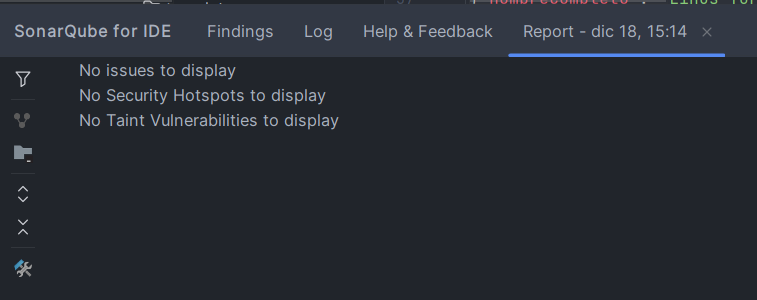

# 🏷️ Microservicio de Usuarios

## 📋 Descripción
Este microservicio gestiona el registro y mantenimiento de los socios de la biblioteca. Se encarga de validar la unicidad del correo electrónico y permite la gestión del estado de actividad de los usuarios (`isActivo`), un requisito indispensable para la autorización de préstamos en el sistema distribuido.

## 🏗️ Arquitectura
- **Spring Boot 3.x** con arquitectura en capas
- **PostgreSQL** como base de datos
- **Spring Cloud Netflix Eureka** para service discovery
- **Spring Data JPA** para persistencia
- **Swagger/OpenAPI** para documentación
- **JUnit 5 + Mockito** para testing

## 🚀 Cómo ejecutar

### 📦 Prerrequisitos obligatorios:
1. ✅ **Java 17+** instalado
2. 🐘 **PostgreSQL 14+** corriendo
3. 🔗 **Eureka Server** corriendo en `http://localhost:8761`
4. 📦 **Maven 3.8+** instalado

### 📝 Pasos:
1. Crear base de datos en PostgreSQL:
```sql
CREATE DATABASE ms_usuarios_db;
```

2. Crear archivo `src/main/resources/env.properties`:
```properties
POSTGRES_USERNAME=postgres
POSTGRES_PASSWORD=tu_contraseñaDePostgresSQL
```

3. Ejecutar el microservicio:
```bash
mvn spring-boot:run
```

## 📊 Datos de prueba
```json
{"nombreCompleto": "Lionel Messi", "email": "info@messi.com"}
{"nombreCompleto": "Ada Lovelace", "email": "ada.programming@analytical.org"}
{"nombreCompleto": "Linus Torvalds", "email": "linus@linuxfoundation.org"}
{"nombreCompleto": "Adele Adkins", "email": "adeleadkins@gmail.com"}
```

## 📸 Captura del análisis SonarLint


## 🛠️ Características
- ✅ CRUD completo de usuarios
- ✅ Validación de email único
- ✅ Baja lógica (desactivación)
- ✅ Manejo centralizado de excepciones
- ✅ Tests unitarios e integración
- ✅ Documentación Swagger/OpenAPI

## 🧪 Testing
```bash
mvn test  # Ejecutar todos los tests
```

## 🔗 Endpoints Principales
| Método | Ruta | Descripción |
|--------|------|-------------|
| POST | `/api/usuarios` | Crear usuario |
| GET | `/api/usuarios` | Listar usuarios |
| GET | `/api/usuarios/{id}` | Obtener por ID |
| PATCH | `/api/usuarios/{id}/desactivar` | Desactivar usuario |
| DELETE | `/api/usuarios/{id}` | Eliminar usuario |


## 🌐 Documentación con Swagger / OpenAPI

Para ver la documentación interactiva de la API, accede a la siguiente URL cuando la aplicación esté en ejecución:

**Swagger UI:** http://localhost:8083/swagger-ui/index.html

**📌 Nota:** Este microservicio corre en el puerto **8083** por defecto.
